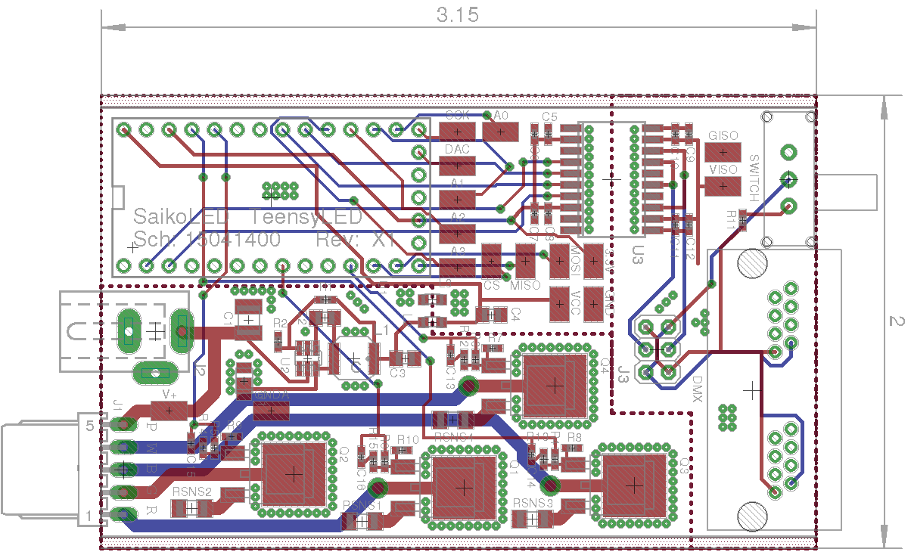
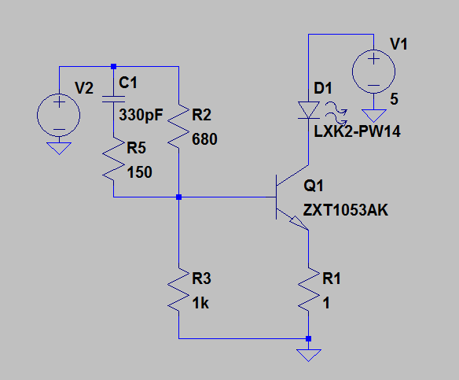
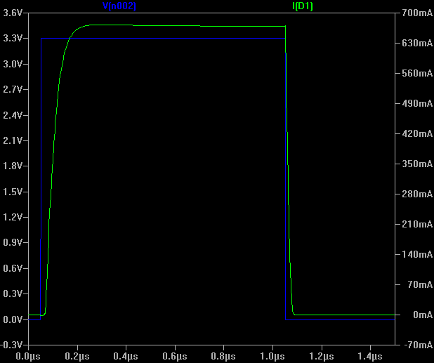
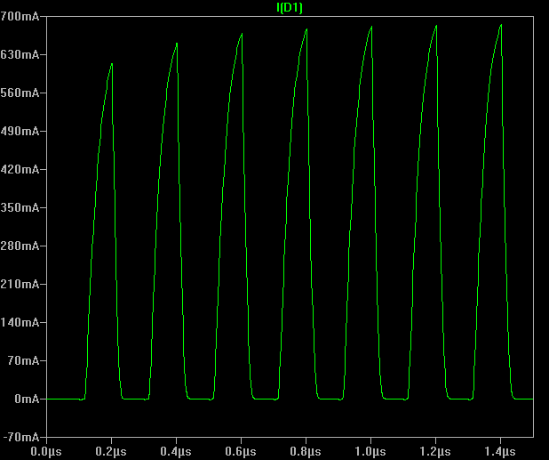
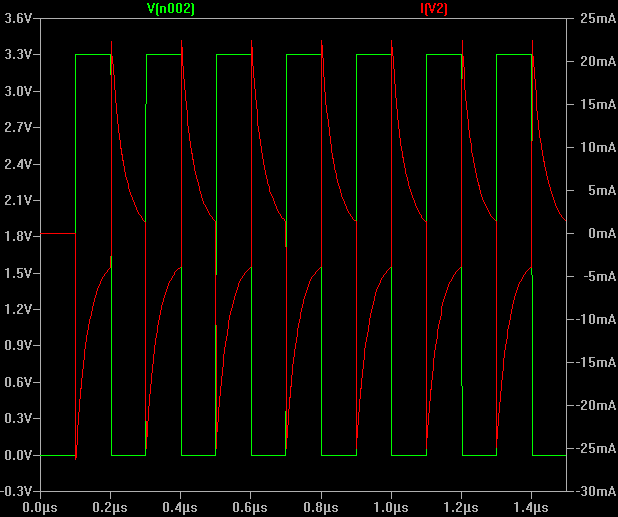

TeensyLED Controller
====================
Copyright Brian Neltner 2015 
Version 0.4 - May 21, 2015

Summary
-------
This provides a basic library and example code for interacting
with a RGBW LED light using Hue, Saturation, and Intensity (HSI)
mode. Also provided are a basic USB interface example, and an example
for using the fully isolated DMX interface.

CircuitHub profile created for this board with pre-identified working
parts.

https://github.com/saikoLED/TeensyLED

Software Features
-----------------
- HSI to RGBW library for interacting with LED sources with color correction.
- PID based fader that follows a random walk through colorspace.
- Tested basic DMX receiving software (just prints DMX data to USB Serial port for now).
- Basic debug example to set the brightness from the USB port.

For more information about the HSI Colorspace developed by SaikoLED
please check out:
- [Why every LED light should be using HSI colorspace.](http://blog.saikoled.com/post/43693602826/why-every-led-light-should-be-using-hsi)
- [How to convert from HSI to RGB+white.](http://blog.saikoled.com/post/44677718712/how-to-convert-from-hsi-to-rgb-white)
- [Implementing arbitrary color correction with the myki!](http://blog.saikoled.com/post/45630908157/implementing-arbitrary-color-correction-with-the)
- [Talk about HSI Colorspace and RGBW](http://blog.saikoled.com/post/71708131057/talk-about-hsi-colorspace-and-rgbw)

If you are curious about our other projects, you can visit our [blog](http://blog.saikoled.com).

Hardware Features
-----------------

[Schematics and Board Drawings](Eagle Design/TeensyLED.pdf)

- Teensy 3.1 socket.
- RJ45-based DMX Connectors as per DMX-512A.
- Fully isolated DMX-compatible RS485 Interface (ADM2582E).
- Header to switch polarity of DMX signal for compatibility.
- 4x 700mA BJT based current sinks (670-730mA typical).
- Current sinks capable of driving 700mA with 75ns pulse widths.
- 75nm pulse width allows 16-bit PWM at 183Hz, or 8-bit PWM at very fast. 16-bit PWM possible at higher PWM frequencies, but with increased non-linearity for low codes. See Simulations directory for more detail on theoretical performance.
- 5-24VDC board compatibility, with the Vin routed directly to LED V+. Up to 5A allowed by CP-202AH-ND barrel plug connector. Voltage limit is due to barrel plug connector, up to 48VDC can be wired directly using the available test point.
- Built in high efficiency switching regulator to provide 3.7VDC.
- Designed to fit into Hammond 1455C801 Extruded Aluminum Enclosure.
- 8-pin expansion header to access 3.3V, GND, DAC, A0 (SCK), A1/A2 (Touch), and DIN/DOUT (SPI/USART).
- PTC Fuse to prevent damage from shorts or over-power.
- Reverse protection diodes on power inlet and flyback diodes on each LED output to prevent reverse bias.

Hardware Performance
--------------------
Simulations have been done on the current sinking circuitry in order to optimize the response time and stability, and real measurements demonstrate comparable performance. Simulations were done using LTSpice and the vendor supplied model for the ZXT1053AK. These simulations are limited in predicting real performance, particularly in the realm of thermal issues.

###Circuit Model

###Current Output with 1μs pulse.

###Current Output with 100ns pulse.

###Estimated current load from controller pin.

Major Hardware Limitations
--------------------------
- Heat dissipation at the BJTs is the primary limiting factor on maximum power. Switching regulators
are unfortunately inappropriate for such high speed PWM capabilities.
  - Although the BJTs chosen are rated to 4.4W each, at 700mA and a
    typical minimum drop from the top of the BJT to ground of 3V for
    good regulation, power dissipation throughout the board is likely
    to be a bare minimum of 2.1W per channel fully on.
  - I think that if you operate the system in HSI mode, where the
    total current sent to the LEDs is limited to 700mA, split between
    the various channels to change colors, you can probably get away
    with as much as 4W from that subsystem. This is power lost in the
    current sink itself, the power of the LEDs is unimportant.
  - This limits the voltage you can have between the *bottom* of your
    LED chain (no matter how long it is) and ground to under *5VDC*.
  - I am thinking about a new design that will automatically regulate
    down the voltage at the top of the LEDs to the minimum needed
    for reliable regulation based on feedback, but this is a work in
    progress. Perhaps for version 2.0.
- High current and high frequency PWM may radiate excessively for FCC. There is a ferrite bead to improve FCC compatibility, but the wiring between this board and the LEDs will be a significant radiator and must be done with care if the result is intended for sale.
- High current and frequency PWM may degrade ADC measurements, especially from high-
    impedance sources.

License
-------
All software, hardware designs, and hardware design files are licensed
under the GPL.

> TeensyLED Controller is free software and hardware: you can redistribute
> it and/or modify it under the terms of the GNU General Public License
> as published by the Free Software Foundation, either version 3 of the
> License, or (at your option) any later version.
> 
> TeensyLED Controller is distributed in the hope that it will be useful,
> but WITHOUT ANY WARRANTY; without even the implied warranty of
> MERCHANTABILITY or FITNESS FOR A PARTICULAR PURPOSE.  See the
> GNU General Public License for more details.
> 
> You should have received a copy of the GNU General Public License
> along with TeensyLED Controller.  If not, see <http://www.gnu.org/licenses/>.
